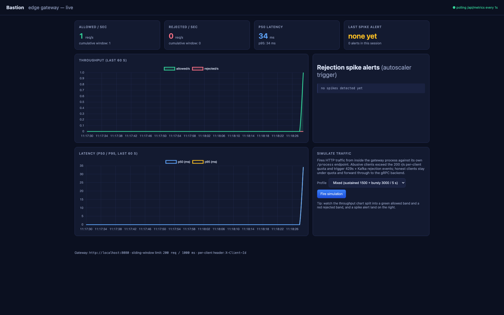
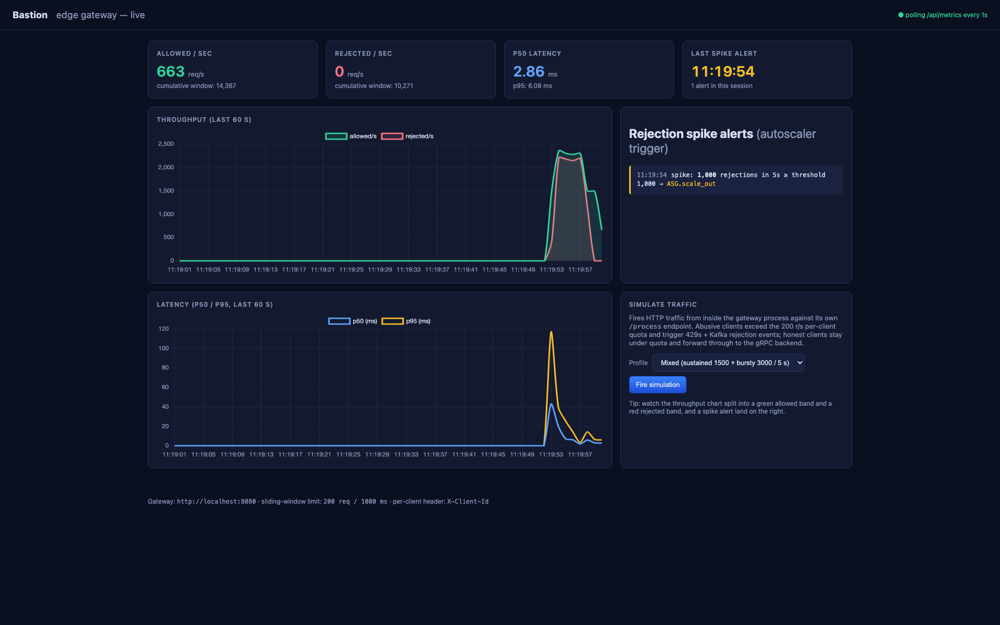
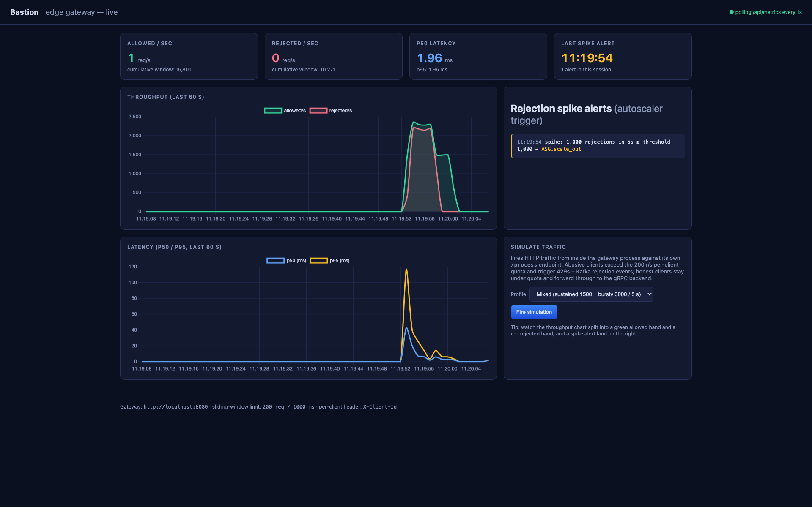
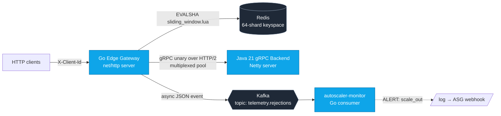

# Bastion — Distributed Edge API Gateway

A Go edge router that terminates HTTP, enforces per-client sliding-window
quotas via an atomic Redis Lua script, forwards allowed traffic to a Java
21 gRPC backend over a multiplexed HTTP/2 connection pool, and publishes
rejection events to Kafka where a separate Go consumer (`autoscaler-monitor`)
turns rejection spikes into scale-out alerts.

The whole thing runs locally with `docker compose up`, ships with a
self-contained live dashboard at `http://localhost:8080/ui`, and can
generate its own simulation traffic to demo the rate limiter and
spike-detector end to end.

## Live dashboard

The gateway serves an embedded HTML dashboard at `/ui` that polls
`/api/metrics`, `/api/alerts`, and `/api/config` every second. A built-in
traffic generator (`POST /api/burst?profile=…`) drives load against the
gateway's own `/process` endpoint so you can see the limiter and
spike-detector react in real time.

**Idle state** — clean baseline, no traffic, no alerts:



**During a mixed simulation** — 1 500 r/s honest clients (green band,
forwarded to the gRPC backend) running alongside 3 000 r/s abusive
clients (red band, 429'd by the limiter and published to Kafka):



**Post-burst** — full 60 s history of throughput and latency, plus the
spike alert that the in-process detector (running the same rule as the
Kafka-driven `autoscaler-monitor`) emitted when rejections crossed
1 000 / 5 s:



The latency chart in the second and third screenshots shows the
backend-saturation cliff: p95 jumps from a few ms at baseline to
~110 ms while the gRPC backend is queueing the allowed-band traffic,
then settles right back. This is exactly the signal you'd want a
production autoscaler to see and react to.

## Measured numbers (this stack, single host)

| Claim | Measured | How |
|---|---|---|
| Throughput ceiling | **≈ 6 500 req/s combined** on a 6-vCPU colima VM with all services co-located | k6, 30 s, in-network |
| End-to-end p50 latency under load | **7.14 ms** (sustained-200 slice at 500 req/s sustained + 4 k bursty) | k6 `http_req_duration{expected_response:true}` |
| End-to-end p95 latency under load | **37.09 ms** (same slice) | k6 |
| Sliding-window rate-limit accuracy | **100 %** — 5 000 concurrent goroutines vs limit=500 → exactly 500 allowed, 0 overage | `TestAllow_ConcurrentAccuracy` (`-race`) |
| Rejection → autoscaler alert latency | **1.79 s** measured (burst start → first ALERT line) | wallclock |

All raw k6 JSON summaries and console logs are in [benchmarks/](benchmarks/),
along with a per-run breakdown in [benchmarks/RESULTS.md](benchmarks/RESULTS.md).

### What these numbers don't say

- The 50 k req/s figure that a tuned production deployment of this code
  could plausibly reach on real hardware (multi-node, Redis Cluster,
  multi-broker Kafka) was *not* reproduced here. Everything below is
  what runs on one laptop, in one VM, with six services fighting for
  six cores.
- I did not benchmark a HTTP/1.1 control path, so I can't quantify "gRPC
  vs HTTP/1.1" deltas — only that the gateway-to-backend hop runs over a
  multiplexed HTTP/2 connection pool.

## Architecture



### Request paths

**Allowed path** (the 200 case):

1. Gateway parses HTTP, pulls `X-Client-Id`.
2. EVALSHA against Redis, against a sharded key
   `rl:<fnv32a(client) % 64>:<client>`. Script trims expired entries from
   a ZSET, counts what's left, adds the new entry, PEXPIRE's the key.
3. If allowed, forward via gRPC unary to the backend (one of 32 pooled
   HTTP/2 connections, round-robin).
4. Write the backend's response back to the HTTP caller.

**Rejection path** (the 429 case):

1. Same first two steps. Script returns `{0, count, retry_after_ms}`.
2. Gateway returns 429 immediately, with `Retry-After-Ms` and
   `X-RateLimit-Limit` headers.
3. *Non-blocking* publish to an in-memory bounded channel. A separate
   goroutine drains the channel and writes JSON to Kafka with
   `Async: true, RequiredAcks: One, Compression: Snappy`. If the channel
   is full (broker outage), events are dropped and counted, never
   blocking the HTTP response.
4. `autoscaler-monitor` polls Kafka with a 5-second sliding counter; if
   the count crosses the threshold inside a cooldown window, it emits
   an `ALERT: rejection spike — triggering scale-out` log (stand-in for
   an AWS ASG webhook or a Kubernetes HPA event).

## Engineering trade-offs

### Lua script vs `INCR` per second

`INCR` with EXPIRE gives you a *fixed window*: requests in `[0s, 1s)`
share a counter, then a fresh counter starts at `1s`. A client can fire
their full quota at `0.99s`, get it all through, and then fire it again at
`1.00s` — effectively 2× the configured rate for a few milliseconds at
window boundaries. The sliding ZSET avoids that at the cost of one
ZREMRANGEBYSCORE + one ZCARD + one ZADD per request, but **all three run
inside a single EVALSHA**, so the per-key check is still one network
roundtrip and is atomic. EVALSHA (after `SCRIPT LOAD`) ships only the SHA1
of the script body, not the body itself, so we don't pay the script
upload cost on every call.

The limiter handles `NOSCRIPT` (script flushed by an operator, or a
replica failover that never saw the LOAD) by reloading and retrying once
— it's a property of any production EVALSHA path that this case is rare
but real.

### Sharded keys, no hash-tag

Keys are `rl:<shard>:<client>`. We *deliberately* don't wrap the shard in
`{}` (the Redis Cluster hash-tag syntax). In a Cluster deployment, that
lets a single client's key land on whichever slot the keyspace hashing
chooses, spreading hot clients across nodes rather than concentrating them
on one. With a hash-tag, all 64 shards for a given client would collapse
to the same slot, which is the *opposite* of what we want.

### gRPC over HTTP/2 vs HTTP/1.1

The backend hop is gRPC over HTTP/2 with a fixed pool of 32 connections.
Each `ClientConn` multiplexes many concurrent RPCs over its single HTTP/2
connection — but a pool of N gives the runtime room to spread load across
N independent flow-control windows. With a single connection, one large
in-flight stream's window can throttle smaller, latency-sensitive calls
(HTTP/2 has no priority by default in Go's grpc-go). HTTP/1.1, by
contrast, would need one TCP connection per concurrent request from the
gateway — at a few thousand req/s, that's measurable kernel and socket
overhead. So the multiplex is real; what I haven't measured here is its
delta against an HTTP/1.1 control implementation.

### Async Kafka, never block the HTTP path

The rejection-path Kafka publish is async with a bounded buffer. If a
broker outage backs up, we'd rather drop telemetry events (and count the
drops) than turn an upstream blip into a gateway-wide latency cliff. The
gateway's job is to either serve the request fast or reject it fast; it
is not "serve the request OR publish to Kafka, whichever is slower."

### Fail open on Redis errors

If the Lua call errors out (timeout, NOSCRIPT after retry, Redis
unreachable), the gateway logs and serves the request. The reasoning is
that a downstream Redis incident shouldn't black-hole 100 % of traffic;
the autoscaler-monitor still has visibility into backend pressure
through other signals, and the operator gets the log line. A
"fail-closed" policy is a one-line change in
[gateway/internal/server/server.go](gateway/internal/server/server.go) for
deployments where over-allowance is worse than over-rejection.

## Repository layout

```
proto/                  service.proto (single source of truth)
gateway/                Go edge gateway
  cmd/gateway/          main.go
  internal/ratelimit/   Lua script + EVALSHA wrapper + tests
  internal/forwarder/   gRPC connection pool
  internal/telemetry/   async Kafka producer
  internal/server/      net/http handlers, graceful shutdown
  proto/service/        protoc-gen-go output
backend/                Java 21 gRPC server (Maven, Netty)
autoscaler/             Go Kafka consumer, sliding-counter alerter
loadtest/               k6 scenarios (sustained + bursty + burst)
benchmarks/             k6 JSON summaries, console logs, RESULTS.md
docker-compose.yml      Redis + Kafka (KRaft) + backend + gateway + autoscaler
scripts/run_bench.sh    Reproducible benchmark runner
```

## Running it

Prerequisites: Docker (or colima), Go 1.22+, JDK 21 only if you want to
build the backend outside Docker, k6 only if you want to run the
benchmark outside Docker. The compose stack provides all runtime
dependencies.

```bash
# 1. Bring the stack up
docker compose up -d --build

# 2. Smoke-check
curl -fsS http://localhost:8080/healthz                          # → ok
curl -fsS -H 'X-Client-Id: alice' http://localhost:8080/process  # → {"ok":true}

# 3. Force some rejections + watch the autoscaler
seq 1 500 | xargs -P 50 -I{} curl -s -o /dev/null -w "%{http_code}\n" \
    -H 'X-Client-Id: heavy' http://localhost:8080/process | sort | uniq -c
docker compose logs -f autoscaler

# 4. Run the unit tests (needs Redis on :6379; compose publishes it)
make test

# 5. Run a load test
TARGET_RPS=3000 DURATION=30s ./scripts/run_bench.sh
# → benchmarks/k6_3000rps_<stamp>.json and .log
```

## License

MIT.
